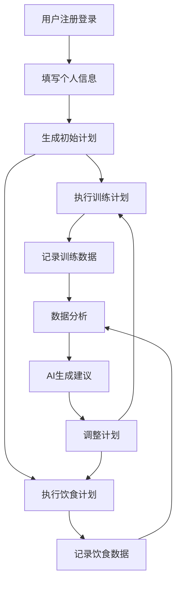

## 1. 产品概述
健身计划平台是一个为用户提供个性化健身计划和饮食规划的应用，结合AI算法提供智能建议。
- 主要解决用户缺乏专业健身指导和饮食规划的问题，帮助用户科学健身，达到理想身材。
- 目标用户为18-40岁的健身爱好者，特别是需要系统指导的健身新手。

## 2. 核心功能

### 2.1 用户角色
| 角色 | 注册方式 | 核心权限 |
|------|---------------------|------------------|
| 普通用户 | 邮箱/手机号注册 | 浏览和使用基本功能，创建个人健身计划 |
| 高级用户 | 升级订阅 | 获得更详细的AI分析和定制化建议 |

### 2.2 功能模块
1. **首页**: 个人数据概览，今日计划，进度追踪
2. **健身计划**: 计划创建，训练安排，动作库
3. **饮食规划**: 饮食记录，营养分析，食谱推荐
4. **数据分析**: 健身数据统计，进度图表，AI建议

### 2.3 页面详情
| 页面名称 | 模块名称 | 功能描述 |
|-----------|-------------|---------------------|
| 首页 | 个人数据概览 | 显示用户基本信息（身高、体重、BMI），健身目标，当前进度 |
| 首页 | 今日计划 | 展示当日训练和饮食安排，完成状态 |
| 首页 | 进度追踪 | 展示近期体重变化，训练频率等关键指标 |
| 健身计划 | 计划创建 | 根据用户目标和身体状况，AI生成个性化训练计划 |
| 健身计划 | 训练安排 | 详细的训练日程，包括动作、组数、次数、重量 |
| 健身计划 | 动作库 | 提供常见健身动作的视频教程和详细说明 |
| 饮食规划 | 饮食记录 | 记录每日饮食摄入，自动计算卡路里和营养成分 |
| 饮食规划 | 营养分析 | 分析用户饮食结构，提供营养均衡建议 |
| 饮食规划 | 食谱推荐 | 根据用户目标和口味偏好，推荐适合的食谱 |
| 数据分析 | 健身数据统计 | 汇总训练数据，包括训练时长、消耗卡路里等 |
| 数据分析 | 进度图表 | 可视化展示体重、体脂率等指标的变化趋势 |
| 数据分析 | AI建议 | 基于用户数据，提供个性化的健身和饮食建议 |

## 3. 核心流程
用户注册登录后，填写个人基本信息（身高、体重、年龄、健身目标等），系统根据这些信息生成初始健身计划和饮食建议。用户可以根据实际情况调整计划，记录每日训练和饮食情况，系统会定期分析数据并提供改进建议。

## 4. 用户界面设计
### 4.1 设计风格
- 主色调：蓝色系（#3B82F6）和绿色系（#10B981），代表健康和活力
- 辅助色：灰色系（#6B7280）用于背景和次要信息
- 按钮风格：圆角按钮，有轻微的3D效果
- 字体：使用现代无衬线字体，主标题18-24px，正文14-16px
- 布局风格：卡片式布局，清晰的信息层次
- 图标风格：简约线条图标，搭配适当的色彩

### 4.2 页面设计概览
| 页面名称 | 模块名称 | UI元素 |
|-----------|-------------|-------------|
| 首页 | 个人数据概览 | 卡片式布局，显示关键数据，使用进度条展示目标完成情况 |
| 首页 | 今日计划 | 时间轴形式展示当日安排，完成项标记为绿色 |
| 首页 | 进度追踪 | 折线图展示数据变化，使用动画效果增强视觉体验 |
| 健身计划 | 计划创建 | 表单输入，滑块选择目标，AI生成结果展示 |
| 健身计划 | 训练安排 | 列表形式展示训练内容，可展开查看详情 |
| 健身计划 | 动作库 | 网格布局展示动作，点击查看详情和视频 |
| 饮食规划 | 饮食记录 | 搜索式添加食物，自动计算营养成分 |
| 饮食规划 | 营养分析 | 饼图展示营养分布，颜色区分不同营养成分 |
| 饮食规划 | 食谱推荐 | 卡片式展示食谱，包含图片、热量和制作时间 |
| 数据分析 | 健身数据统计 | 数字卡片展示关键指标，使用渐变色增强视觉效果 |
| 数据分析 | 进度图表 | 多种图表类型，支持时间范围选择 |
| 数据分析 | AI建议 | 卡片式展示建议，重要建议使用醒目标记 |

### 4.3 响应性
- 采用移动端优先设计，确保在手机、平板和桌面设备上都有良好的体验
- 针对触摸设备优化交互，增大点击区域，支持滑动操作
- 在小屏幕设备上合理调整布局，确保关键信息优先显示

### 4.4 3D场景指导（可选）
- 考虑在动作库中添加3D动画展示，帮助用户更直观地理解动作要领
- 使用WebGL技术实现，确保在现代浏览器中流畅运行
- 提供多角度查看功能，帮助用户掌握正确的动作姿势