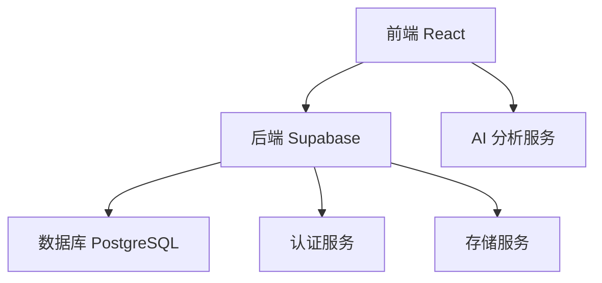
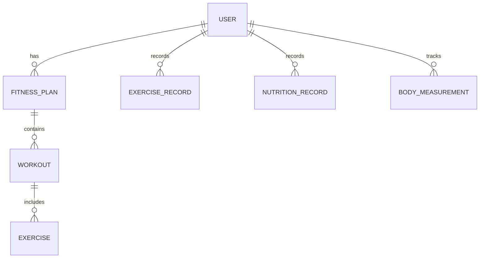

## 1. 架构设计


## 2. 技术描述
- 前端: React@18 + tailwindcss@3 + vite
- 初始化工具: vite-init
- 后端: Supabase
- 数据库: Supabase (PostgreSQL)
- 状态管理: Zustand
- 路由: React Router DOM
- 图表库: Recharts
- 图标库: Lucide React

## 3. 路由定义
| 路由 | 用途 |
|-------|---------|
| / | 首页，个人数据概览 |
| /fitness-plan | 健身计划页面 |
| /nutrition | 饮食规划页面 |
| /analytics | 数据分析页面 |
| /profile | 个人资料页面 |

## 4. API 定义
### 4.1 认证相关
- 注册: POST /auth/signup
- 登录: POST /auth/signin
- 登出: POST /auth/signout

### 4.2 用户数据相关
- 获取用户信息: GET /user/profile
- 更新用户信息: PUT /user/profile

### 4.3 健身计划相关
- 获取训练计划: GET /fitness/plans
- 创建训练计划: POST /fitness/plans
- 更新训练计划: PUT /fitness/plans/:id
- 获取动作库: GET /fitness/exercises

### 4.4 饮食规划相关
- 获取饮食记录: GET /nutrition/records
- 添加饮食记录: POST /nutrition/records
- 获取营养分析: GET /nutrition/analysis
- 获取食谱推荐: GET /nutrition/recipes

### 4.5 数据分析相关
- 获取健身数据: GET /analytics/fitness
- 获取营养数据: GET /analytics/nutrition
- 获取AI建议: GET /analytics/ai-suggestions

## 5. 数据模型
### 5.1 数据模型定义


### 5.2 数据定义语言
#### 用户表 (users)
```sql
CREATE TABLE users (
    id UUID PRIMARY KEY,
    email TEXT UNIQUE NOT NULL,
    name TEXT,
    height NUMERIC,
    weight NUMERIC,
    age INTEGER,
    fitness_goal TEXT,
    created_at TIMESTAMP DEFAULT NOW()
);
```

#### 健身计划表 (fitness_plans)
```sql
CREATE TABLE fitness_plans (
    id UUID PRIMARY KEY,
    user_id UUID REFERENCES users(id),
    name TEXT NOT NULL,
    goal TEXT,
    start_date DATE,
    end_date DATE,
    created_at TIMESTAMP DEFAULT NOW()
);
```

#### 训练表 (workouts)
```sql
CREATE TABLE workouts (
    id UUID PRIMARY KEY,
    plan_id UUID REFERENCES fitness_plans(id),
    day_of_week INTEGER,
    name TEXT,
    duration INTEGER,
    created_at TIMESTAMP DEFAULT NOW()
);
```

#### 动作表 (exercises)
```sql
CREATE TABLE exercises (
    id UUID PRIMARY KEY,
    name TEXT NOT NULL,
    description TEXT,
    video_url TEXT,
    category TEXT,
    created_at TIMESTAMP DEFAULT NOW()
);
```

#### 训练动作表 (workout_exercises)
```sql
CREATE TABLE workout_exercises (
    id UUID PRIMARY KEY,
    workout_id UUID REFERENCES workouts(id),
    exercise_id UUID REFERENCES exercises(id),
    sets INTEGER,
    reps INTEGER,
    weight NUMERIC,
    created_at TIMESTAMP DEFAULT NOW()
);
```

#### 训练记录表 (exercise_records)
```sql
CREATE TABLE exercise_records (
    id UUID PRIMARY KEY,
    user_id UUID REFERENCES users(id),
    exercise_id UUID REFERENCES exercises(id),
    date DATE,
    sets INTEGER,
    reps INTEGER,
    weight NUMERIC,
    created_at TIMESTAMP DEFAULT NOW()
);
```

#### 饮食记录表 (nutrition_records)
```sql
CREATE TABLE nutrition_records (
    id UUID PRIMARY KEY,
    user_id UUID REFERENCES users(id),
    food_name TEXT,
    calories NUMERIC,
    protein NUMERIC,
    carbs NUMERIC,
    fat NUMERIC,
    date DATE,
    meal_type TEXT,
    created_at TIMESTAMP DEFAULT NOW()
);
```

#### 身体测量表 (body_measurements)
```sql
CREATE TABLE body_measurements (
    id UUID PRIMARY KEY,
    user_id UUID REFERENCES users(id),
    weight NUMERIC,
    body_fat NUMERIC,
    date DATE,
    created_at TIMESTAMP DEFAULT NOW()
);
```

## 6. 技术实现要点
### 6.1 前端实现
- 使用 React 18 的 Concurrent Mode 提高应用性能
- 使用 Tailwind CSS 实现响应式设计
- 使用 Zustand 进行状态管理，保持状态逻辑清晰
- 使用 React Router DOM 实现路由管理
- 使用 Recharts 实现数据可视化
- 使用 Lucide React 提供图标支持

### 6.2 后端实现
- 使用 Supabase 提供认证、数据库和存储服务
- 使用 PostgreSQL 数据库存储用户数据和健身计划
- 实现 RLS (Row Level Security) 确保数据安全
- 使用 Supabase 函数处理复杂业务逻辑

### 6.3 AI 算法集成
- 集成简单的 AI 算法，根据用户数据生成个性化健身和饮食建议
- 使用用户历史数据进行分析，提供改进建议
- 基于用户目标和当前状态，调整训练和饮食计划

### 6.4 数据安全
- 使用 HTTPS 确保数据传输安全
- 实现 JWT 认证机制
- 使用 Supabase 的 RLS 保护用户数据
- 对敏感数据进行加密存储